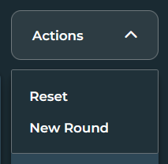

# Simple Tic Tac Toe

A minimalistic and simple project of the traditional Tic Tac Toe game made using HTML, CSS and JavaScript ES6.

## The Game

As mentioned, the website just features a simple 3x3 Tic Tac Toe board game that can be played by 2 users, each player's turn is indicated along with their symbol ( X or O ).
Their is also a scoreboard in the bottom of the board that tracks the statistics of the round, those being: Player 1's Wins, Player 2's Wins and Tie Games.

Upon the finishing of a game the screen shows what is the result.

Clicking the Play Again button resets the board and adds the result into the current scoreboard.

## Functionalities

The web game features an Actions dropdown menu box that allows the users to perform two functions - Reset the game board or start a New Round by clearing the exisiting stats on the scoreboard.

The game can be played in one tab or 2 individual tabs (of the same URL) with both being in sync with the other's moves.

That is all!
